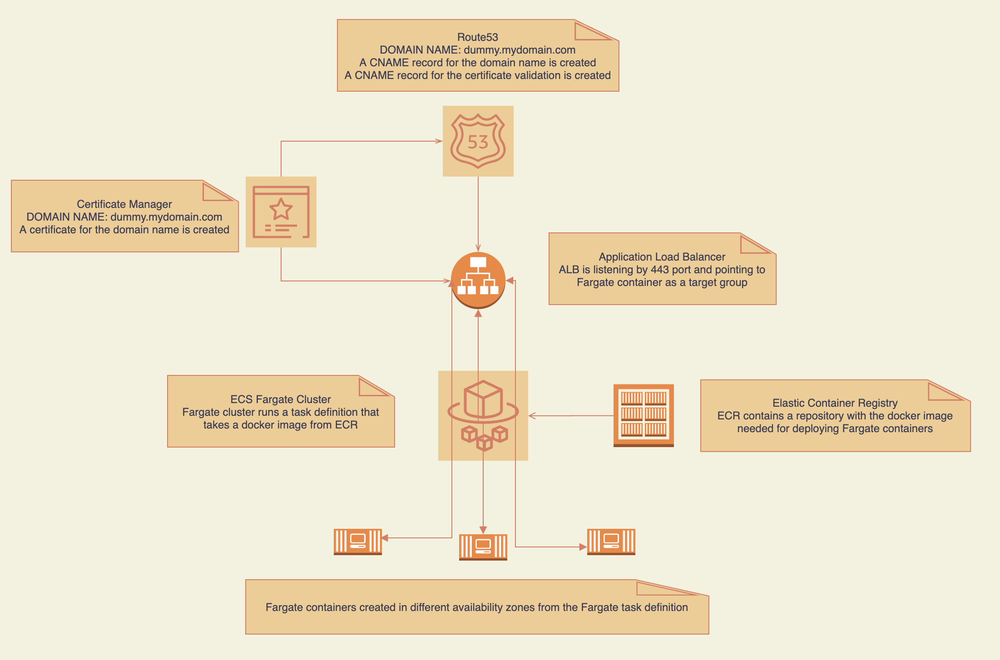
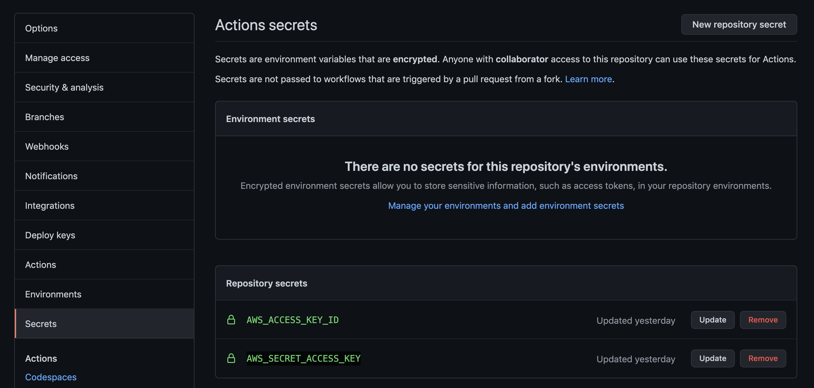

# <b>HTTPS Application in AWS ECS Fargate</b>

## <b>Repo description</b>

This provides a simple Infrastructure for a HTTPS application in AWS. The HTTPS application runs over NGINX containers in AWS Fargate.

The Infrastructure deployed consists on:

- ECS: Containers provided in a Fargate Cluster from a Fargate task executed by the corresponding Fargate service. The docker image is being pulled from ECR registry. See ```variables``` section below
- ALB: Application load balancer pointing to ECS num_containers listening by 443 port.
- ACM: A validated Certificate for HTTPS listener in the ALB.
- Route53:
    - DNS record as an alias of ALB dns name. This way, the Application URL can be customised.
    - DNS record for certifcate validation

Security groups, target groups, IAM policies, VPC and so on, are already provided by this repo.


<br/>

## Files and Folder structure

- <b>app:</b> Directory for the application files. In this repo it's a simple html file

- <b>iac:</b> Directory for terraform code

- <b>Dockerfile:</b> Dockerfile for creating NGINX image

- <b>.github/workflows/main.yml:</b> Github action for building and pushing hte Docker image to the ECR registry. If ECR registry doesn't exist yet, the Github action will do.
<br/>

## Getting Started

#### Pre-requisites
> :warning: Create ECR image (if you didn't do it before)

- Github pre-requisites:

  1. Fork or clone the repo in your Github account. Then, add AWS_ACCESS_KEY_ID and AWS_SECRET_ACCESS_KEY secrets in your repo.
  
  <br/><br/>

  2. ECR variables must be modified in the [Github Action](https://github.com/seavba/fargate-dummy/blob/main/.github/workflows/main.yml#L7-L10)
    - aws-region: eu-west-1
    - image_tag: dummy
    - ecr_repo: docker_images
    - aws_ecs_service: dummy_service
    - aws_ecs_cluster: dummy_ecs_cluster <br/>

  2. Commit and push the step 1 (above) changes to the repo and a Github action will build and push a new Docker image in the ECR registry. If ECR registry doesn't exist yet, the Github action will do.

- AWS CLI must be already configured. If not, try [Configuration and credential file settings](https://docs.aws.amazon.com/cli/latest/userguide/cli-configure-files.html)

- The Terraform code has been wrote with Terraform v0.15.3.


#### Deploy

Once Dummy docker image has been created, for providing such infrastructure, it's needed to run:

```
cd /your/repo/path
git clone  git@github.com:seavba/fargate-dummy.git
cd fargate-dummy/iac && terraform init && terraform apply
```
```terraform apply`` command asks for confirmation, write ```yes``` if you want to proceed with the deployment.


#### Variables
All the variables to be customised (if needed) can be found in [variables.tf](https://github.com/seavba/fargate-dummy/blob/master/variables.tf) file.


- ###### Output Variables
After deployment, as output variables are shown:
```
Outputs:
url = "Enjoy you dummy box https://dummybis.ssans.es"
```
> :warning: The URL shown in the output message is the Application link. It can be test it in any browser.


#### Destroy Infrastructure

```
cd /your/repo/path
cd fargate-dummy/iac && terraform destroy
```
```terraform destroy``` command asks for confirmation, write ```yes``` if you want to proceed with the deployment revert.


## Demo

Play the following video and enjoy:

[](https://www.youtube.com/watch?v=1zc09DMztMI)


## Webgraphy

The following websites helped me to understand better how to implement the solution:

- [Building, deploying, and operating containerized applications with AWS Fargate](https://aws.amazon.com/es/blogs/compute/building-deploying-and-operating-containerized-applications-with-aws-fargate/)

- [Terraform](https://www.terraform.io/)
